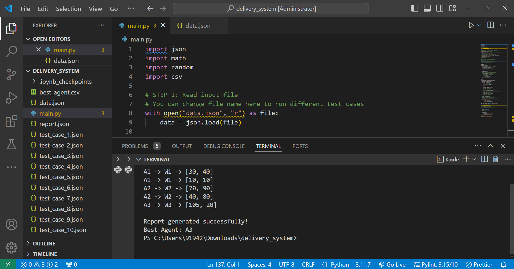
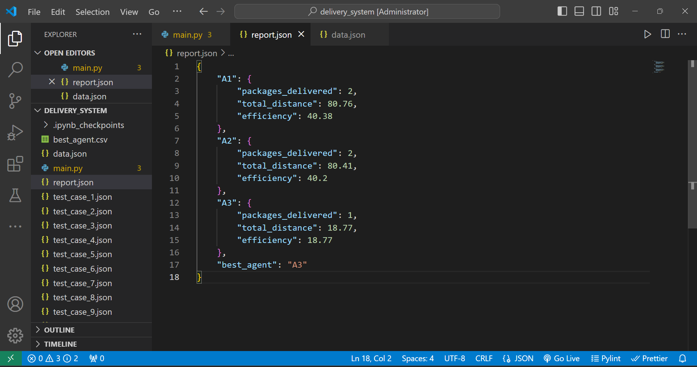
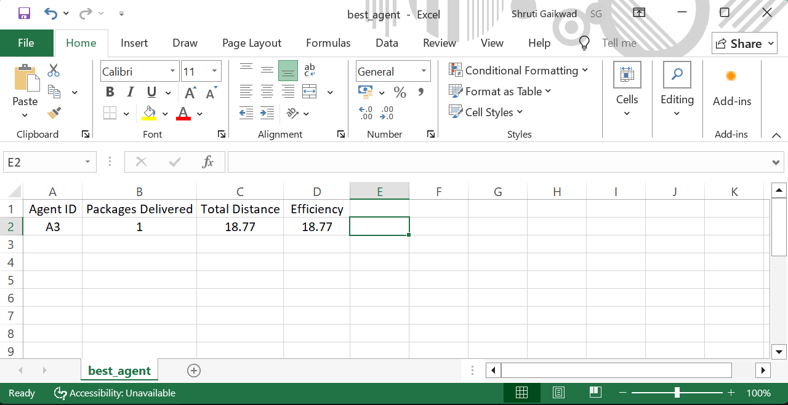

# Delivery System

This is a Python project where I created a simple delivery system simulation.

In this project, there are multiple warehouses, delivery agents, and packages. The program reads input data from a JSON file and assigns each package to the nearest agent based on distance.

After assigning the packages, it calculates how much distance each agent travels and how many packages they deliver. Based on that, it also finds which agent is the most efficient.

I have also handled different input formats in the JSON file so the program works with multiple test cases.

Some extra features I added:
- random delay to simulate real-world delivery conditions  
- simple route display in console  
- adding a new agent dynamically  
- exporting best agent details into a CSV file  

## How to run the project

1. Make sure Python is installed  
2. Keep your input file as `data.json` (you can use any test case)  
3. Run the program:

## Output

- `report.json` → contains delivery report  
- `best_agent.csv` → contains best agent details  

## Screenshots

### Program Output

### Report File

### Best Agent CSV

## What I learned

- Working with JSON files in Python  
- Using loops and conditions for logic building  
- Calculating distance using formula  
- Handling different input formats  
- Writing clean and understandable code  
